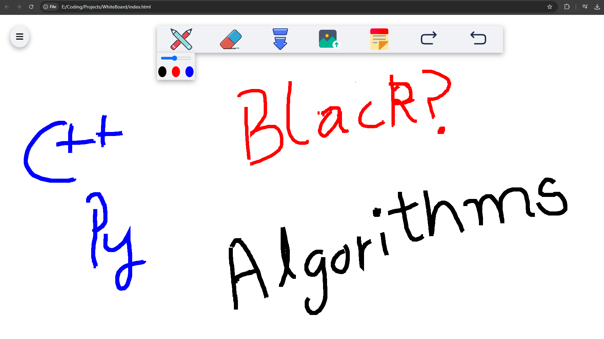
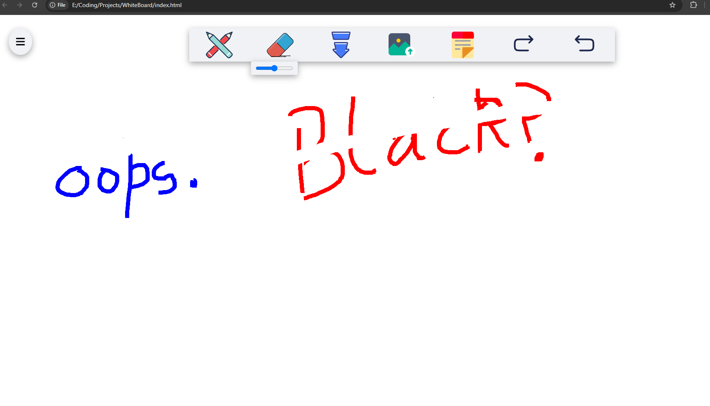
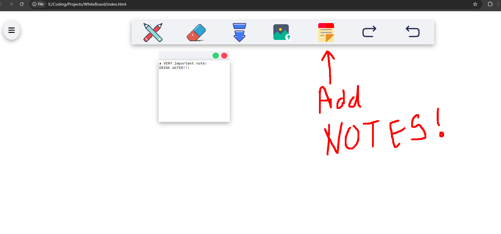
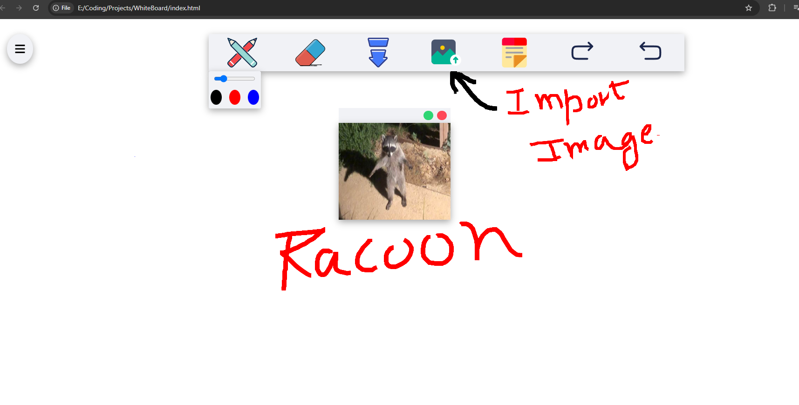
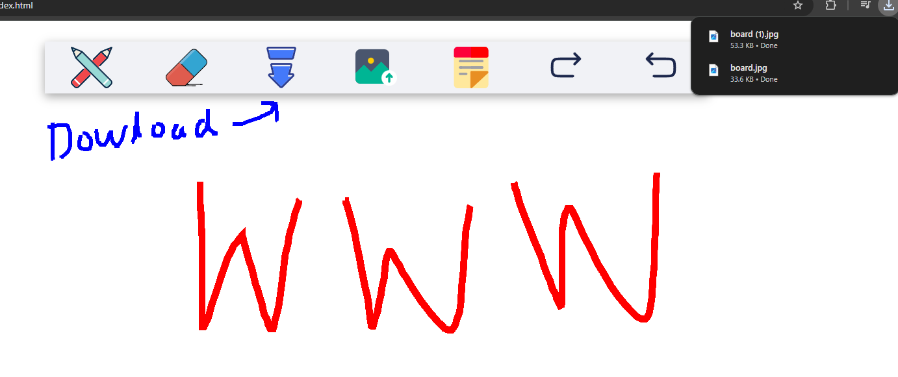

# WhiteBoard 
WhiteBoard is created using HTML, CSS, JavaScript, Canvas API.
# Features and Demo: 
• Pen tool

• Eraser tool

• Sticky Notes

• Import image to your canvas

• Download canvas as a JPG file

